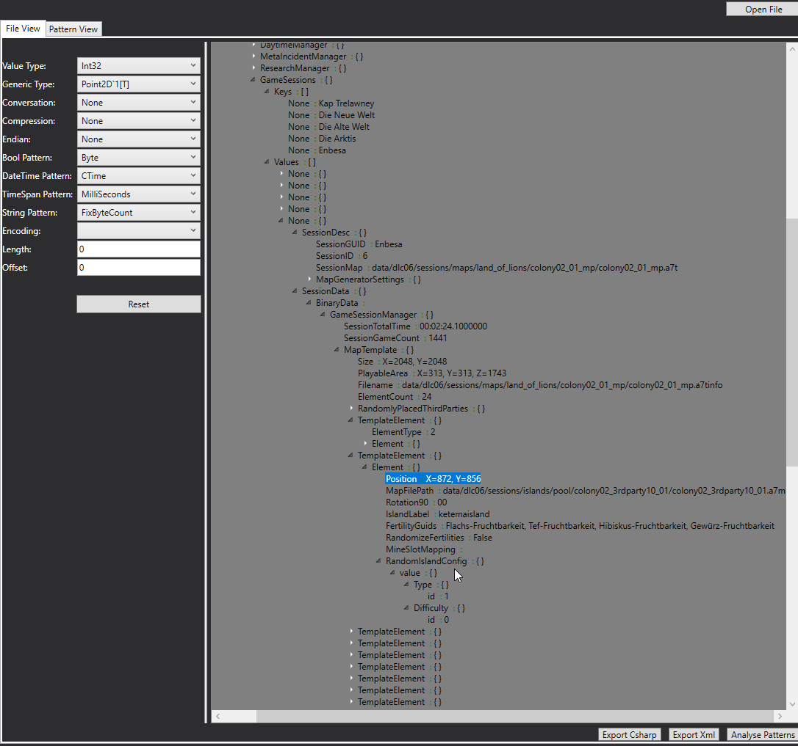
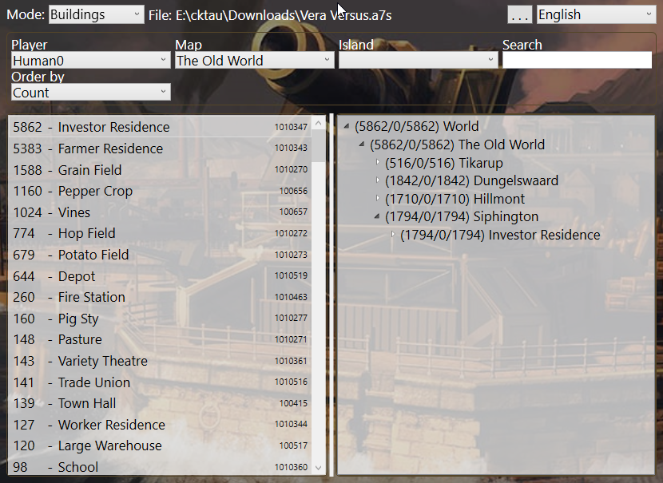

# Anno 1800 Savegame Viewer


The save game viewer is splitted into 3 parts:

### Class Creator
---
    
The class creator are used to inspect different Anno 1800 files.
It can read different file formats that are used by Anno including
the "rda" and the "db" format up to a size of 2 GB and present it
in a treeview.  
You can set datatypes for the shown content fields 
and export the data either as xml or as a full set of C# class files.

>

### Anno Serializer
---
    
The serializer is the core of the project that make it possible read 
the binary anno files and serialize it into the class structure
that are generated by the class creator.
All created types are flagged with attributes that handles the
conversation to various types:
```csharp 
BinaryContent(Name = "Filename", NodeType = BinaryContentTypes.Attribute, Encoding = "utf-16")]
public String Filename { get; set; }
```
Sample Code to load a file into a class structure:
```csharp
namespace AnnoSavegameViewer {
  using System.Threading.Tasks;
  using AnnoSerializer.Serialization;
  using AnnoSerializer.Structures.Generated.a7s;


  public static class SaveGameReader {
    public async static Task ReadFileAsync(string filePath) {
      var savegame = await AnnoFileSerializer.ReadFileAsync<A7s_File>(filePath);
      var seed = savegame.A7s_File_RDA.Block_02.Gamesetup_a7s.GameSetupManager.GameSeed;
    }
  }
}
```

### Anno Savegame Viewer
---

A sample front-end for the data is the savegame viewer, which one shows
the amount of items, buildings and buffs that come from items.
You can filter by participant, map and island.



#### Download:
Download for each part is available [here](https://github.com/Veraatversus/AnnoSavegameViewer/releases)  
  
>*Requirements are the [.NET Desktop Runtime 5.0.0](https://dotnet.microsoft.com/download/dotnet/5.0) or you can download a **standalone version** 
which one has already included that.** 